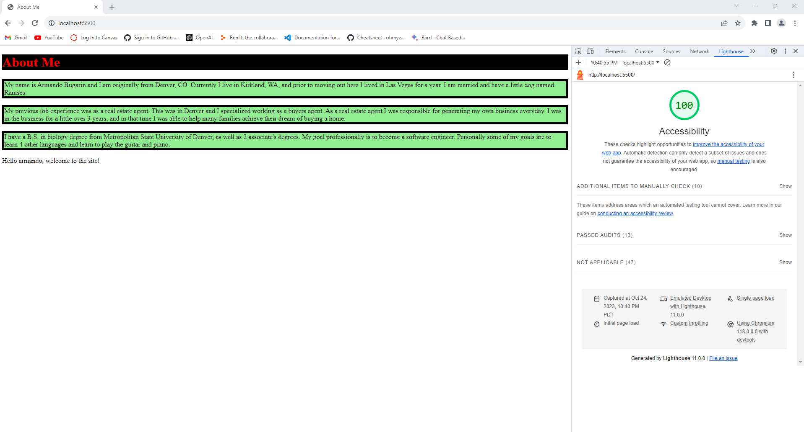
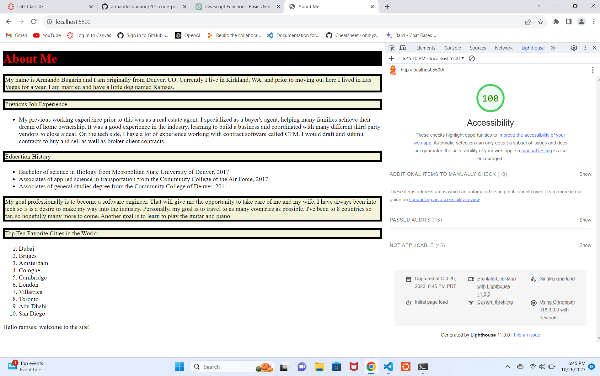
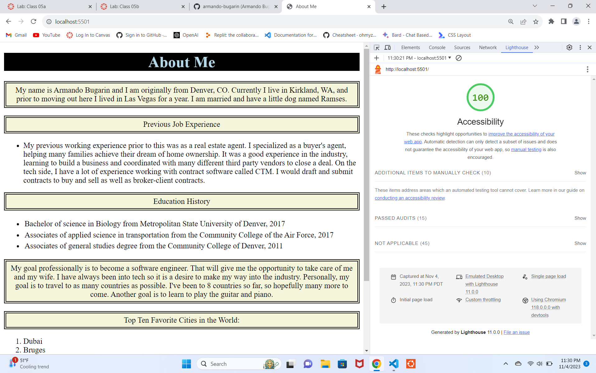

# 201-code-project

## Screenshot of Lighthouse report Lab 2

## New Features Adding for Lab 3

In lab 3, adding a ordered list of a "top ten" for me. This "top ten" can be any topic. Convert my work experience and education into an unordered list. And in Javascript, adding two more questions. One question is giving the user four opportunities to guess a number. The other question gives the user six attempts to answer a question. The last question has mulitple answers so we are to use an array.

## Screenshot of Lighthouse Report Lab 3

## Screen of Lighthouse Report Lab 5b

